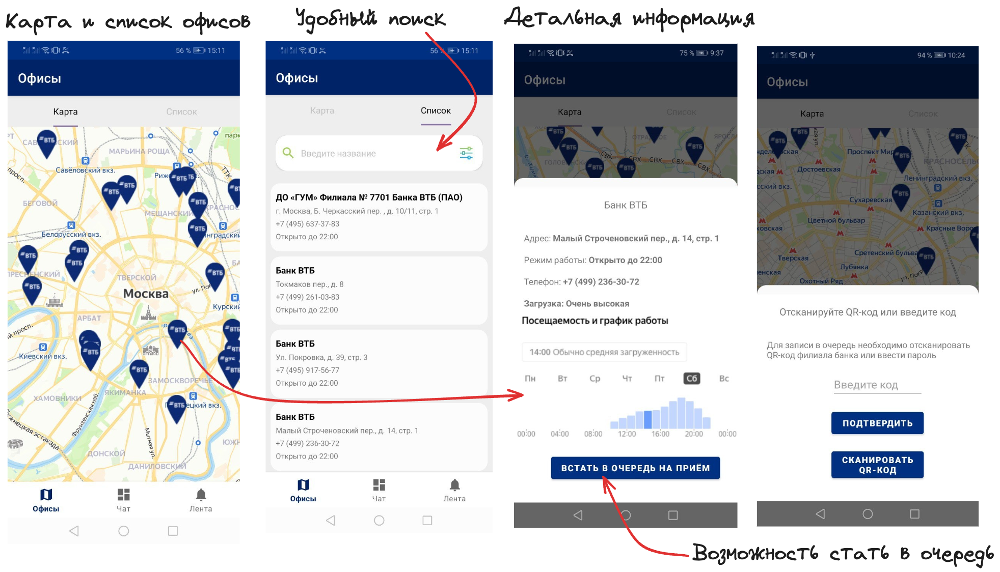

# Проект для Хакатона
Это проект, выполненный в рамках хакатона More.Tech 5.0

## Демонстрация проекта 📌:

## Презентация проекта 📚:
[Презентация](https://docs.google.com/presentation/d/1udXaKmAd1VcBymd7Stl-40qhBsJICpWVQ6fSk6LceRU/edit?usp=sharing)

## Приложение позволяет найти офис, посмотреть загруженность и решить проблемы пользователя:

- Просматривать список офисов на карте/списке (Рекомендуемые, Ближайший по геолокации)
- Добавлять в избранное понравившиеся офисы
- Использовать чат-бота для ответа на вопросы
- Видеть загруженность

## Ключевые особенности проекта:
- Офисы в виде карты и списка с детальным отображением
- Возможонсть встать в электронную очередь
- Поиск
- Отображение загруженности офисов
- Истории полезные для пользователя

## В проекте используются следующие библиотеки и фрэймворки:
- Kotlin
- Groupie для построения сложных списков на базе RecyclerView. [Ссылка](https://github.com/lisawray/groupie)
- Android Navigation для навигации между экранами. [Подробнее](https://developer.android.com/guide/navigation/navigation-getting-started)
- [ViewPager 2.0](https://developer.android.com/training/animation/vp2-migration)

## Установка:
- Для установки достаточно скачать zip-архив
- Распаковать
- Открыть с помощью Android Studio
- Подключить Android-устройство и нажать кнопку Run

